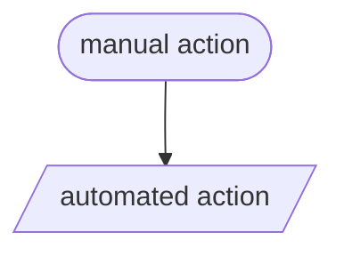

---

# Legacy Workflow

This doc contains diagrams illustrating the old workflow the Loki team followed to release new versions.

In the following diagrams, stadium-shaped nodes indicate manual actions, while parallelagrams indicate automated actions.



## Workflow Overview

Here is a general overflow of the workflow required to release a new version of Loki. I have collapsed the drone pipeline into a single node, see below for a detailed version of the drone pipeline.

```mermaid
graph TD;
    start([Decide to release]) --> branch([Create release branch from weekly branch]);
    start --> announce([Announce release in #loki-releases]);
    start --> issue([Create GitHub issue announcing release]);
    branch --> changes([Make changes to release branch]);
    changes --> checkChangelog([Check Changelog]);
    checkChangelog --> changelogHeader([Update the Unrealeased changelog header]);
    changelogHeader --> changelogMain([PR updated changelog headers into main]);
    changelogHeader --> prChangelog([PR changelog into release branch]);
    changes --> releaseNotes([Curate Release Notes]);
    releaseNotes --> prReleaseNotes([PR release notes into release branch]);
    prChangelog --> mergePRs([Merge outstanding PRs]);
    prReleaseNotes --> mergePRs;
    mergePRs --> tag([Tag release]);
    changes --> binaryVersions([Update references to binary/image versions]);
    binaryVersions --> prVersions([PR updated versions references into release branch]);
    binaryVersions --> isLatestVersion([Is release for latest version?])
    isLatestVersion --> |yes| prVersionsMain([PR updated versions references into main branch]);
    prVersionsMain --> waitForPublish([Wait for release to be published])
    changes --> checkConfigs([check if we made any config changes])
    checkConfigs --> |yes| updateUpgradingDoc([update upgrading doc with changed configs])
    checkConfigs --> |no| --> tag
    updateUpgradingDoc --> |push doc changes| prUpgradingDoc([PR upgrading doc changes into release branch])
    updateUpgradingDoc --> |push doc changes| prUpgradingDocMain([PR upgrading doc changes into main branch])
    prUpgradingDoc --> tag;
    announce --> tag;
    issue --> tag;
    binaryVersions --> tag;
    tag --> |Push tag| drone[/Trigger Drone Pipeline/];
    drone --> |Wait for Drone Pipeline| copyReleaseNotes([Copypublishrelease notes into release])
    copyReleaseNotes --> publish([Publish release])
    publish --> waitForPublish
    waitForPublish --> |published| mergeVersionRefs([Merge updated version refs PR into main])
```

## Detailed Drone Pipeline

```mermaid
graph TD;
    E[/Trigger Drone Pipeline/] --> F[/build loki build image/];
    E --> G[/build helm test image/];

    E --> H[/check drone drift/];
    H --> I[/check generated files/];
    I --> J[/run tests/];
    J --> K[/run linters/];
    K --> L[/check gomod/];
    L --> M[/run shellcheck/];
    M --> N[/build loki binary/];
    N --> O[/check doc drift/];
    O --> P[/validate example configs/];
    P --> Q[/check example config docs/];
    Q --> R[/build docs website/];

    E --> S[/lint mixin jsonnet/];

    E --> T[/check helm values doc/];

    E --> U[/publish loki amd64 image to dockerhub/];
    U --> V[/publish loki-canary amd64 image to dockerhub/];
    V --> W[/publish logcli amd64 image to dockerhub/];

    E --> X[/publish loki arm64 image to dockerhub/];
    X --> Y[/publish loki-canary arm64 image to dockerhub/];
    Y --> Z[/publish logcli arm64 image to dockerhub/];

    E --> a[/publish loki arm image to dockerhub/];
    a --> b[/publish loki-canary arm image to dockerhub/];
    b --> c[/publish logcli arm image to dockerhub/];

    E --> d[/publish promtail amd64 image to dockerhub/];
    E --> f[/publish promtail arm64 image to dockerhub/];
    E --> g[/publish promtail arm image to dockerhub/];

    E --> h[/publish lokioperator amd64 image to dockerhub/];
    E --> i[/publish lokioperator arm64 image to dockerhub/];
    E --> j[/publish lokioperator arm image to dockerhub/];

    E --> k[/publish fluent-bit amd64 image to dockerhub/];

    E --> l[/publish fluentd amd64 image to dockerhub/];

    E --> m[/publish logstash amd64 image to dockerhub/];

    E --> n[/publish querytee amd64 image to dockerhub/];

    E --> o[/publish multi-arch promtail image to dockerhub/];
    o --> p[/publish multi-arch loki image to dockerhub/];
    p --> q[/publish multi-arch loki-canary image to dockerhub/];
    q --> r[/publish multi-arch loki-operator image to dockerhub/];

    E --> s[/prepare updater config/];
    E --> t[/trigger updater/];

    E --> u[/check if helm chart needs update/];
    u --> v[/prepre helm chart update/];
    v --> w[/trigger helm chart update/];

    E --> x[/test promtail-windows/];

    E --> y[/publish logql analyzer image to dockerhub/];

    E --> z[/setup linux packaging/];
    z --> aa[/test linux packaging/];
    aa --> ab[/test debian packaging/];
    ab --> ac[/test rpm packaging/];
    ac --> ad[/create github draft release/];

    E --> ae[/build and publish docker driver to dockerhub/];

    E --> af[/build and publish lambda-promtail amd64 image to dockerhub/];

    E --> ag[/build and publish lambda-promtail arm64 image to dockerhub/];
```


